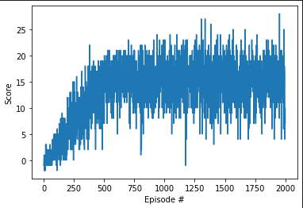

Report

# Learning Algorithm Description
* Algorithm: Deep Q Learning (DQN)
* Implementation adapted from Udacity course exercise..
* The DQN algorithm was originally described in the paper [Human-level control through deep reinforcement
learning](https://storage.googleapis.com/deepmind-media/dqn/DQNNaturePaper.pdf)

# Ideas for Future Work
This algorithm solves the environment without hyperparameter tuning.  

## Improving final performance of the agent in this environment

## Improving sample efficiency

## Improving the DQN algorithm generally
The DQN algorithm solves the Banana environment without hyperparameter tuning.  Because of that, it seems like there is little reason to continue to experiment with this environment.  Choosing environments with more complexity and known benchmarks would be good next steps.  

For the goal of improving the agent for this environment, we could still at least have two goals.  Improve the agent's final performance or improve the efficiency of learning.  Hyperparameter tuning is a good place to start for either one.  

  * Hyperparameter tuning
  * find a good set of hyperparameters for a similar task
    * RL baselines zoo
    * look for similar tasks in published work on ml-agents
    * do manual hyperparameter tuning
        * choose a few of the hyperpararemeters and modify them manually.  running a lot of experiments and tracking results 
  * Implement things from the Rainbow paper.  The paper combined various improvements that have been made in DQN and did ablation studies to deterimine the importance of each change.  Start with the most important changes or implement all of them.  
  * Run with multiple seeds
  * Update environment to be used with up to date ml-agents package
    * This would allow for using other implementations of DQN like those from stable baselines 3, cleanRL, and Sample Factory.  
    * While it is useful to write out the code and try to implement improvements as a learning exercise, it is also useful to have a known good implementation to compare against. 
  * running with a different algorithm
  * Increasing speed of training
  * using curiosity for exploration
  * save every x episodes
  * log more learning metrics
  * integrate with tensorboard and/or weights and biases

# Plot of Rewards
* As shown in the jupyter notebook, training was done for 2000 episodes.  
* an episode is defined as x timesteps or y
* rewards are accumulated for blah and shown as the score

## Requirements

### Learning algorithm description
-[] The report clearly describes the learning algorithm, along with the chosen hyperparameters. It also describes the model architectures for any neural networks.

### Plot of Rewards

-[] A plot of rewards per episode is included to illustrate that the agent is able to receive an average reward (over 100 episodes) of at least +13. The submission reports the number of episodes needed to solve the environment.

### Ideas for Future Work

-[] The submission has concrete future ideas for improving the agent's performance.